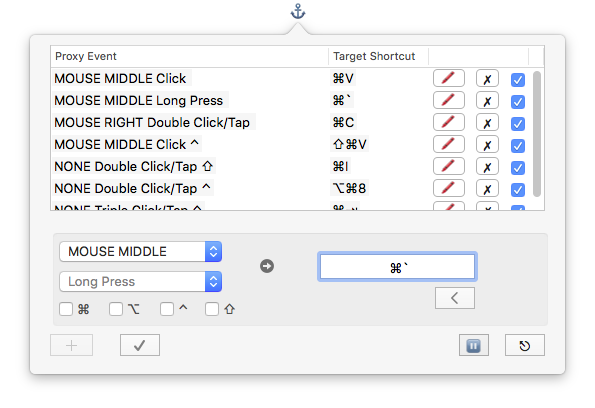

### DESCRIPTION

Most of OS X users may use ⌘V (paste from the clipboard) everyday. _Hooky_ can assign another event such as _Mouse Middle Button Click_ to ⌘V so that you can paste data using Mouse Middle Click as well as ⌘V.

⌘V is one of easy keystrokes, so there may be little benefit to assign another event to it. But some shortcuts such as ⌥⌘8 (zoom in/out) might not be so easy to press. 

Hooky can be used to assign more easier and simpler events to existing shortcuts/hotkeys you use frequently.

Events being assigned such as _Mouse Middle Button Click_ are referred to as _Proxy Events_ in Hooky. Also the shortcuts to invoke such as ⌘V are referred to as _Target Shortcuts_.

Currently, Hooky offers two types of _Proxy Events_:
- **Mouse Click Events**
  - Long press, Single/Double/Triple click for any of left, right, middle buttons
  - One or more of Modifier Keys (⌘⌥⇧⌃) may be involved.
- **Multiple Keystrokes on Modifier Keys** (MKM events)
  - Only works for single Modifier Key (⌘ or ⌥ or ⇧ or ⌃)
  - No other regular keys or mouse buttons are involved.
  - Double/Triple/Quadruple tappings are supported 
      - Note that single tap is not supported because it will cause lots of conflicts.
  - e.g., You may _double tap on ⌥_ to switch applications instead of pressing ⌘-Tap.

And Hooky won't (more precisely, can't) modify any of target shortcuts. So users always have options of invoking the designated event by either of Hooky's proxy event or the existing shortcut.

### BENEFITS
- Can assign complicated (so hard to press and hard to remember) shortcut keys to a simpler and easier type of events.
- Each or all of proxy events easily can be turned off and revived later.
- No elevated privilege (e.g., root) required
- No [Accessibility API](https://developer.apple.com/accessibility/osx/ "") being used 
  - So users **DON'T** have to deal with the hassle of Opening _System Preferences > Security & Privacy > Accessibility_ and registering Hooky as a legitimate app.
- Hooky is tiny. its resource footprint is small.

### LIMITATIONS
Let's say, one of your applications already has occupied a mouse middle click event to invoke one of its functionalities. Then, technically, Hooky won't have a chance to detect the mouse middle click event. In this case, mouse middle click can't be used as a proxy event for Hooky. 

**Generally speaking, Hooky can't detect any of events being used by applications with higher privileged apps** (including apps permitted to use Accessibility API)

Also, for instance, when you assign a right click (or control left click) as a proxy event, you'll always see context menus showing up (your designated target shortcut will be invoked too, though)

**Note that Hooky will never touch preallocated UI events**. Those UI events will always trigger preassigned (by the system or other applications) behaviors like right click triggers context menu showing up. In that sense, registering left or right mouse click events as Hooky's proxy events is not recommended because they are already bound to so many functions. Using mouse middle click, however, is recommended and relatively safe because Apple's documentation says that the system doesn't preoccupy any of mouse middle click events.

**For MKM proxy events, you should not press any of regular keys while pressing the modifier keys.** Hooky can't detect regular key strokes (this limitation is imposed by Apple. Non-previliged applications can't detect global or other app's regular key press events). Let's say, while tapping ⌘ modifier key twice, which has been assigned for zooming up screen (⌥⌘=) by you, if you press the 'H' key accidentally or intentionally, your front app will become hidden (⌘H does that by default as you know). And then your empty screen will be zoomed up. This kind of accident happens because currently, Hooky can't detect regular key press so it can't prevent them.

### SYSTEM REQUIREMENTS
OS X 10.9+

It has not been tested on 10.9 and 10.10.

Currently, it is being developed and tested on OS X 10.11+ with Xcode 7.3+.

### HOW TO INSTALL AND RUN
- Install
  - Just copy the .app file into your _/Application_ directory.  
- Run
  - Double click the app file directly or open spotlight and type _Hooky_
- Uninstall
  - Trash the .app file

### DEVELOPMENT REQUIREMENTS
- Xcode 7.2+

### COPYRIGHT/LICENSE/DISCLAIMER

    Copyright (c) 2016 Suewon Bahng, suewonjp@gmail.com
    
    Licensed under the Apache License, Version 2.0 (the "License");
    you may not use this file except in compliance with the License.
    You may obtain a copy of the License at
    
        http://www.apache.org/licenses/LICENSE-2.0
    
    Unless required by applicable law or agreed to in writing, software
    distributed under the License is distributed on an "AS IS" BASIS,
    WITHOUT WARRANTIES OR CONDITIONS OF ANY KIND, either express or implied.
    See the License for the specific language governing permissions and
    limitations under the License.

* * *
Written by Suewon Bahng   ( Last Updated 26 March, 2016 )

### CONTRIBUTORS
Suewon Bahng  

Other contributors are welcome!
